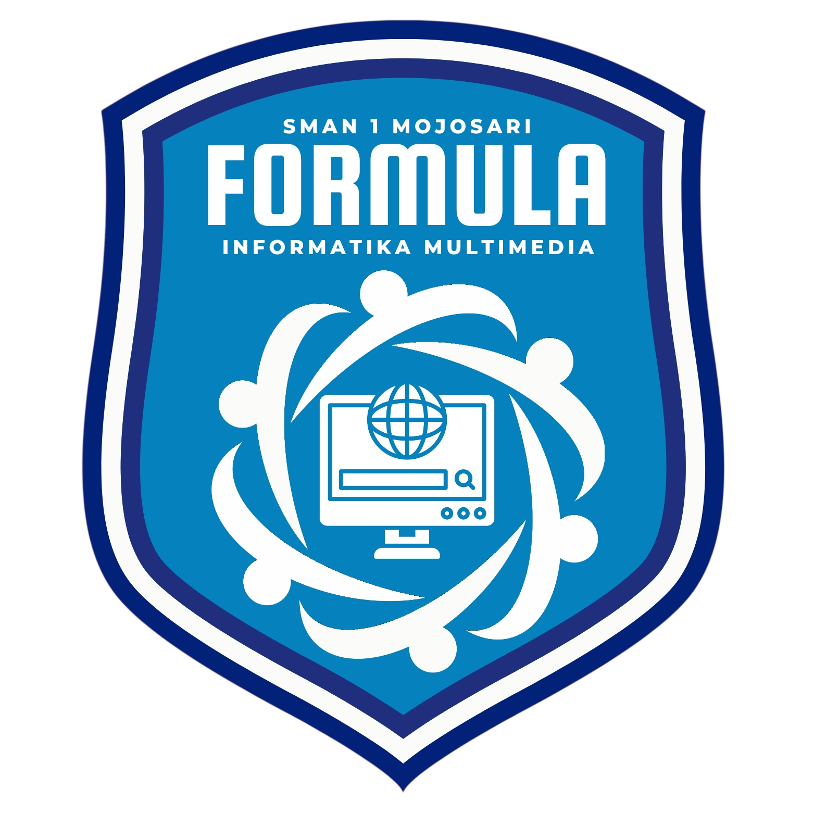

<div align="center">



<br/>

**Central Platform / Digital Ecosystem untuk Organisasi Ekstrakurikuler Modern**

Website profil + dashboard organisasi + manajemen anggota + project management + learning platform + documentation center — **semua dalam satu ekosistem.**

<br/>

<a href="https://www.formula-sman1mojosari.my.id/">
  
</a>
<a href="#">
  
</a>
<a href="#">
  
</a>
<a href="#">
  
</a>

<br/><br/>


<br/><br/>


</div>

---

<div align="center">

### 📖 Daftar Isi

<table>
<tr>
<td valign="top" width="33%">

**🎯 Tentang**
- [Overview](#-overview)
- [Kenapa FORMULA?](#-kenapa-formula)
- [Highlight Fitur](#-highlight-fitur)

**🏗️ Struktur**
- [Arsitektur](#%EF%B8%8F-arsitektur)
- [Struktur Folder](#-struktur-folder)
- [Tech Stack](#-tech-stack)

</td>
<td valign="top" width="33%">

**🎨 Design**
- [Design System](#-design-system)
- [Color Palette](#-color-palette)
- [Typography](#-typography)

**🔐 Sistem**
- [Role & Permission](#-role--permission)
- [Sistem Maintenance](#-sistem-maintenance)

</td>
<td valign="top" width="33%">

**🚀 Cara Pakai**
- [Quick Start](#-quick-start)
- [Development](#-development)
- [Deployment](#-deployment)

**📊 Info**
- [Roadmap](#-roadmap)
- [Contributing](#-contributing)
- [Kontak](#-kontak)

</td>
</tr>
</table>

</div>

---

## 🎯 Overview

<div align="center">

<table>
<tr>
<td align="center" width="25%">
<br/>
<b>Halaman Publik</b><br/>
<sub>Etalase organisasi</sub>
</td>
<td align="center" width="25%">
<br/>
<b>Fitur Internal</b><br/>
<sub>Dashboard & sistem</sub>
</td>
<td align="center" width="25%">
<br/>
<b>Role Pengguna</b><br/>
<sub>RBAC terstruktur</sub>
</td>
<td align="center" width="25%">
<br/>
<b>Responsive</b><br/>
<sub>Mobile-first design</sub>
</td>
</tr>
</table>

</div>

**FORMULA** (Informatika dan Multimedia) adalah ekstrakurikuler di SMAN 1 Mojosari. Repositori ini berisi **Central Platform** — ekosistem digital terpadu yang menggabungkan:

<table>
<tr>
<td width="50%" valign="top">

### 🌐 Untuk Publik
- 🏫 **Profil organisasi** — etalase resmi
- 📰 **Berita & pengumuman** — update kegiatan
- 🖼️ **Galeri** — dokumentasi visual
- 🏆 **Achievement** — showcase prestasi
- 👥 **Direktori anggota** — privacy-safe
- 🎓 **Alumni network** — jejaring mantan anggota

</td>
<td width="50%" valign="top">

### 🔐 Untuk Internal
- 📊 **Dashboard anggota** — overview personal
- 📁 **Project management** — tracking & kanban
- ✅ **Task management** — pembagian tugas
- 📚 **Learning center** — modul pembelajaran
- 📅 **Event & attendance** — kelola kegiatan
- ⚙️ **Admin dashboard** — kontrol penuh

</td>
</tr>
</table>

---

## 💡 Kenapa FORMULA?

<div align="center">

> ### *"Useful > Beautiful · Scalable > Temporary · Secure > Convenient · Organized > Complicated"*

</div>

<br/>

<table>
<tr>
<th align="center" width="20%">Aspek</th>
<th align="center" width="40%">Traditional Ekskul Website</th>
<th align="center" width="40%">🚀 FORMULA Platform</th>
</tr>
<tr>
<td align="center"><b>Fungsi</b></td>
<td>❌ Sekadar profil & kontak</td>
<td>✅ <b>Ekosistem lengkap</b> dengan dashboard</td>
</tr>
<tr>
<td align="center"><b>Data</b></td>
<td>❌ Tersebar di Google Drive & WhatsApp</td>
<td>✅ <b>Terpusat</b> di satu platform</td>
</tr>
<tr>
<td align="center"><b>Anggota</b></td>
<td>❌ Tidak ada sistem keanggotaan</td>
<td>✅ <b>RBAC</b> dengan 9 role</td>
</tr>
<tr>
<td align="center"><b>Project</b></td>
<td>❌ Tidak terdokumentasi</td>
<td>✅ <b>Project management</b> built-in</td>
</tr>
<tr>
<td align="center"><b>Learning</b></td>
<td>❌ Materi tercecer</td>
<td>✅ <b>Learning center</b> terstruktur</td>
</tr>
<tr>
<td align="center"><b>Absensi</b></td>
<td>❌ Manual, rawan hilang</td>
<td>✅ <b>QR attendance</b> otomatis</td>
</tr>
<tr>
<td align="center"><b>Maintenance</b></td>
<td>❌ Tidak ada</td>
<td>✅ <b>Guard system</b> + animasi premium</td>
</tr>
<tr>
<td align="center"><b>Privacy</b></td>
<td>❌ Data sensitif terekspos</td>
<td>✅ <b>Public/private separation</b></td>
</tr>
</table>

---

## ✨ Highlight Fitur

<div align="center">

### 🌐 Public Website

<table>
<tr>
<td align="center" width="20%">
<b>🏠 Home</b><br/>
<sub>Hero, stats, program</sub>
</td>
<td align="center" width="20%">
<b>ℹ️ About</b><br/>
<sub>Sejarah, visi misi</sub>
</td>
<td align="center" width="20%">
<b>📋 Programs</b><br/>
<sub>Program kerja</sub>
</td>
<td align="center" width="20%">
<b>🚀 Projects</b><br/>
<sub>Portfolio karya</sub>
</td>
<td align="center" width="20%">
<b>👥 Members</b><br/>
<sub>Direktori publik</sub>
</td>
</tr>
<tr>
<td align="center">
<b>📰 News</b><br/>
<sub>Berita & artikel</sub>
</td>
<td align="center">
<b>🖼️ Gallery</b><br/>
<sub>Foto & video</sub>
</td>
<td align="center">
<b>🏆 Achievements</b><br/>
<sub>Prestasi</sub>
</td>
<td align="center">
<b>🎓 Alumni</b><br/>
<sub>Jejaring alumni</sub>
</td>
<td align="center">
<b>📞 Contact</b><br/>
<sub>Formulir kontak</sub>
</td>
</tr>
</table>

</div>

<br/>

<div align="center">

### 🔐 Authentication & Member

<table>
<tr>
<td align="center" width="25%">
<b>🔑 Login</b><br/>
<sub>Multi-role auth</sub>
</td>
<td align="center" width="25%">
<b>📝 Register</b><br/>
<sub>Multi-step form</sub>
</td>
<td align="center" width="25%">
<b>📊 Dashboard</b><br/>
<sub>Member overview</sub>
</td>
<td align="center" width="25%">
<b>👤 Profile</b><br/>
<sub>Public & private</sub>
</td>
</tr>
</table>

</div>

<br/>

<div align="center">

### 🛠️ Admin Powerhouse

<table>
<tr>
<td align="center" width="25%">
<b>👥 User Management</b><br/>
<sub>CRUD + import massal</sub>
</td>
<td align="center" width="25%">
<b>📊 Project Control</b><br/>
<sub>Assign, monitor</sub>
</td>
<td align="center" width="25%">
<b>📝 Content CMS</b><br/>
<sub>Berita, gallery</sub>
</td>
<td align="center" width="25%">
<b>📈 Analytics</b><br/>
<sub>Data & chart</sub>
</td>
</tr>
<tr>
<td align="center">
<b>🔔 Notifications</b><br/>
<sub>Realtime push</sub>
</td>
<td align="center">
<b>📋 Activity Log</b><br/>
<sub>Audit trail</sub>
</td>
<td align="center">
<b>⚙️ System Settings</b><br/>
<sub>Konfigurasi</sub>
</td>
<td align="center">
<b>💾 Backup</b><br/>
<sub>Export & restore</sub>
</td>
</tr>
</table>

</div>

---

## 🏗️ Arsitektur

```
┌─────────────────────────────────────────────────────────────────┐
│                     🌐 USER BROWSER                             │
│   (Chrome · Safari · Firefox · Edge · Mobile)                   │
└────────────────────────────┬────────────────────────────────────┘
                             │ HTTPS
                             ▼
┌─────────────────────────────────────────────────────────────────┐
│                    🎨 PRESENTATION LAYER                        │
│  ┌─────────────────────────────────────────────────────────┐   │
│  │  HTML5 · CSS3 · Vanilla JavaScript                      │   │
│  │  Zero CDN · Self-contained · Design System              │   │
│  └─────────────────────────────────────────────────────────┘   │
└────────────────────────────┬────────────────────────────────────┘
                             │
                             ▼
┌─────────────────────────────────────────────────────────────────┐
│                     🧠 LOGIC LAYER                              │
│  ┌──────────────┬──────────────┬──────────────┬─────────────┐  │
│  │  Auth Guard  │  Maintenance │  RBAC System │  State Mgmt │  │
│  │  (Session)   │  (Guard JS)  │  (Role/Perm) │  (Storage)  │  │
│  └──────────────┴──────────────┴──────────────┴─────────────┘  │
└────────────────────────────┬────────────────────────────────────┘
                             │
                             ▼
┌─────────────────────────────────────────────────────────────────┐
│                     💾 DATA LAYER                               │
│  ┌───────────────────┬──────────────────┬────────────────────┐ │
│  │  Config JSON      │  localStorage    │  External API      │ │
│  │  (maintenance)    │  (session)       │  (Supabase/etc)    │ │
│  └───────────────────┴──────────────────┴────────────────────┘ │
└─────────────────────────────────────────────────────────────────┘
```

---

## 📁 Struktur Folder

```
📦 formula/
│
├── 🌐 PUBLIC PAGES
│   ├── 📄 index.html              → Home
│   ├── 📄 about.html              → About
│   ├── 📄 programs.html           → Programs
│   ├── 📄 projects.html           → Projects
│   ├── 📄 members.html            → Members
│   ├── 📄 news.html               → News
│   ├── 📄 gallery.html            → Gallery
│   ├── 📄 achievements.html       → Achievements
│   ├── 📄 alumni.html             → Alumni
│   └── 📄 contact.html            → Contact
│
├── 🔐 AUTHENTICATION
│   ├── 📄 login.html              → Login
│   ├── 📄 register.html           → Register (multi-step)
│   └── 📄 forgot-password.html    → Reset password
│
├── 📊 MEMBER AREA
│   ├── 📄 dashboard.html          → Member dashboard
│   ├── 📄 profile.html            → Profile
│   ├── 📄 tasks.html              → Task list
│   ├── 📄 learning.html           → Learning center
│   ├── 📄 events.html             → Events
│   └── 📄 attendance.html         → Attendance
│
├── 👑 ADMIN AREA
│   ├── 📄 admin.html              → Admin dashboard
│   └── 📄 admin-settings.html     → System settings
│
├── 🚧 SYSTEM
│   ├── 📄 maintenance.html        → Maintenance page
│   ├── 📄 maintenance-config.json → Config
│   ├── 📄 maintenance-guard.js    → Guard script
│   ├── 📄 404.html                → Error page
│   └── 📄 gateway.html            → Loading gateway
│
├── 🎨 ASSETS
│   ├── 📁 css/                    → CSS files
│   ├── 📁 js/                     → JS files
│   ├── 📁 img/                    → Images
│   ├── 📁 icons/                  → Icons
│   └── 📁 fonts/                  → Local fonts
│
├── 📚 DOCS
│   ├── 📄 README.md               → This file
│   ├── 📄 CHANGELOG.md            → Version history
│   ├── 📄 CONTRIBUTING.md         → Contribution guide
│   ├── 📄 LICENSE                 → MIT License
│   └── 📄 fitur-cbt.html          → CBT feature list
│
└── 🔧 CONFIG
    ├── 📄 .gitignore
    └── 📄 vercel.json             → Vercel config
```

---

## 🛠️ Tech Stack

<div align="center">

<table>
<tr>
<td align="center" width="20%">
<br/>
<b>HTML5</b><br/>
<sub>Semantic</sub>
</td>
<td align="center" width="20%">
<br/>
<b>CSS3</b><br/>
<sub>Custom Properties</sub>
</td>
<td align="center" width="20%">
<br/>
<b>JavaScript</b><br/>
<sub>Vanilla · ES6+</sub>
</td>
<td align="center" width="20%">
<br/>
<b>Git</b><br/>
<sub>Version control</sub>
</td>
<td align="center" width="20%">
<br/>
<b>GitHub</b><br/>
<sub>Hosting</sub>
</td>
</tr>
<tr>
<td align="center">
<br/>
<b>Vercel</b><br/>
<sub>Deploy</sub>
</td>
<td align="center">
<br/>
<b>Netlify</b><br/>
<sub>Deploy</sub>
</td>
<td align="center">
<br/>
<b>Supabase</b><br/>
<sub>Backend (future)</sub>
</td>
<td align="center">
<br/>
<b>VS Code</b><br/>
<sub>Editor</sub>
</td>
<td align="center">
<br/>
<b>Figma</b><br/>
<sub>Design</sub>
</td>
</tr>
</table>

</div>

**Prinsip:** `Zero CDN` · `Self-contained` · `No build tools` · `Direct open in browser`

---

## 🎨 Design System

<div align="center">

### Color Palette

<table>
<tr>
<td align="center" width="16.6%">
<br/>
<b>Primary</b><br/>
<code>#1A73E8</code>
</td>
<td align="center" width="16.6%">
<br/>
<b>Secondary</b><br/>
<code>#34A853</code>
</td>
<td align="center" width="16.6%">
<br/>
<b>Accent</b><br/>
<code>#EA4335</code>
</td>
<td align="center" width="16.6%">
<br/>
<b>Warning</b><br/>
<code>#FBBC04</code>
</td>
<td align="center" width="16.6%">
<br/>
<b>Dark</b><br/>
<code>#202124</code>
</td>
<td align="center" width="16.6%">
<br/>
<b>Light</b><br/>
<code>#F8F9FA</code>
</td>
</tr>
</table>

### Typography

<table>
<tr>
<th align="left">Role</th>
<th align="left">Font</th>
<th align="left">Weights</th>
<th align="left">Preview</th>
</tr>
<tr>
<td><b>Heading</b></td>
<td>Plus Jakarta Sans</td>
<td>500 · 600 · 700 · 800</td>
<td><h3>Formulasi Kreatif</h3></td>
</tr>
<tr>
<td><b>Body</b></td>
<td>Inter</td>
<td>400 · 500 · 600 · 700</td>
<td>Konten yang mudah dibaca.</td>
</tr>
<tr>
<td><b>Mono</b></td>
<td>JetBrains Mono</td>
<td>400 · 500 · 600</td>
<td><code>const formula = true;</code></td>
</tr>
</table>

### Breakpoints

<table>
<tr>
<th>📱 Mobile</th>
<th>📱 Tablet</th>
<th>💻 Desktop</th>
</tr>
<tr>
<td align="center"><code>&lt; 640px</code></td>
<td align="center"><code>640px – 1024px</code></td>
<td align="center"><code>&gt; 1024px</code></td>
</tr>
</table>

</div>

---

## 👑 Role & Permission

<div align="center">

<table>
<tr>
<th align="center">Role</th>
<th align="center">Level</th>
<th align="center">Warna</th>
<th align="left">Deskripsi</th>
</tr>
<tr>
<td align="center"><b>🦸 Super Admin</b></td>
<td align="center"><code>100</code></td>
<td align="center">🔴</td>
<td>Akses penuh + system settings</td>
</tr>
<tr>
<td align="center"><b>👑 Admin</b></td>
<td align="center"><code>90</code></td>
<td align="center">🟠</td>
<td>Manajemen sistem & konten</td>
</tr>
<tr>
<td align="center"><b>🎖️ Ketua</b></td>
<td align="center"><code>80</code></td>
<td align="center">🟡</td>
<td>Manajemen organisasi</td>
</tr>
<tr>
<td align="center"><b>🎗️ Wakil Ketua</b></td>
<td align="center"><code>75</code></td>
<td align="center">🟢</td>
<td>Manajemen organisasi (akses sesuai)</td>
</tr>
<tr>
<td align="center"><b>👨‍🏫 Pembina</b></td>
<td align="center"><code>70</code></td>
<td align="center">🔵</td>
<td>Monitoring & approval</td>
</tr>
<tr>
<td align="center"><b>🧑‍💼 Koordinator</b></td>
<td align="center"><code>60</code></td>
<td align="center">🟣</td>
<td>Manajemen divisi & project</td>
</tr>
<tr>
<td align="center"><b>👤 Anggota</b></td>
<td align="center"><code>40</code></td>
<td align="center">⚪</td>
<td>Project, task, learning, event</td>
</tr>
<tr>
<td align="center"><b>🎓 Alumni</b></td>
<td align="center"><code>30</code></td>
<td align="center">🟤</td>
<td>Akses khusus alumni</td>
</tr>
<tr>
<td align="center"><b>🌐 Public</b></td>
<td align="center"><code>10</code></td>
<td align="center">⚫</td>
<td>Konten publik saja</td>
</tr>
</table>

</div>

---

## 🚧 Sistem Maintenance

<div align="center">

### 📋 File Terkait

| File | Fungsi | Ikon |
|---|---|---|
| `maintenance.html` | Halaman maintenance premium | 🎨 |
| `maintenance-config.json` | Kontrol on/off | ⚙️ |
| `maintenance-guard.js` | Script redirect otomatis | 🛡️ |

</div>

### 🔧 Cara Aktifkan

<table>
<tr>
<th>Step</th>
<th>Aksi</th>
<th>Hasil</th>
</tr>
<tr>
<td align="center"><b>1</b></td>
<td>Buka <code>maintenance-config.json</code></td>
<td>Lihat konfigurasi</td>
</tr>
<tr>
<td align="center"><b>2</b></td>
<td>Ubah <code>"enabled": false</code> → <code>true</code></td>
<td>Config ter-update</td>
</tr>
<tr>
<td align="center"><b>3</b></td>
<td>Save</td>
<td>✅ Semua halaman auto-redirect</td>
</tr>
</table>

### 🔓 Bypass Admin

```
https://website.com/index.html?bypass=formula-admin-2025
```

### 👁️ Preview (tanpa aktifkan)

```
https://website.com/maintenance.html?preview=1
```

---

## 🚀 Quick Start

<div align="center">

### ⚡ 3 Langkah Memulai

<table>
<tr>
<td align="center" width="33%">
<h1>1️⃣</h1>
<b>Clone / Download</b><br/>
<sub>Ambil repository</sub>
<br/><br/>
<code>git clone ...</code>
</td>
<td align="center" width="33%">
<h1>2️⃣</h1>
<b>Open in Browser</b><br/>
<sub>Klik index.html</sub>
<br/><br/>
<code>index.html</code>
</td>
<td align="center" width="33%">
<h1>3️⃣</h1>
<b>Enjoy! 🎉</b><br/>
<sub>Website siap</sub>
<br/><br/>
<code>Selamat berkarya</code>
</td>
</tr>
</table>

</div>

### 💻 Development Server

<table>
<tr>
<th>Cara</th>
<th>Command</th>
<th>URL</th>
</tr>
<tr>
<td>🟢 <b>Live Server</b></td>
<td><em>Klik kanan → Open with Live Server</em></td>
<td><code>http://127.0.0.1:5500</code></td>
</tr>
<tr>
<td>🐍 <b>Python 3</b></td>
<td><code>python -m http.server 8000</code></td>
<td><code>http://localhost:8000</code></td>
</tr>
<tr>
<td>📦 <b>Node.js</b></td>
<td><code>npx http-server -p 8000</code></td>
<td><code>http://localhost:8000</code></td>
</tr>
<tr>
<td>🐘 <b>PHP</b></td>
<td><code>php -S localhost:8000</code></td>
<td><code>http://localhost:8000</code></td>
</tr>
</table>

> ⚠️ **Jangan buka via `file://`** — fitur maintenance & fetch akan diblokir browser.

---

## 🚀 Deployment

<div align="center">

<table>
<tr>
<td align="center" width="25%">
<h1>▲</h1>
<b>Vercel</b><br/>
<sub>Recommended</sub><br/><br/>
<a href="https://vercel.com"></a>
</td>
<td align="center" width="25%">
<h1>◆</h1>
<b>Netlify</b><br/>
<sub>Easy setup</sub><br/><br/>
<a href="https://netlify.com"></a>
</td>
<td align="center" width="25%">
<h1>◆</h1>
<b>Cloudflare</b><br/>
<sub>Fast CDN</sub><br/><br/>
<a href="https://pages.cloudflare.com"></a>
</td>
<td align="center" width="25%">
<h1>◆</h1>
<b>GitHub Pages</b><br/>
<sub>Free</sub><br/><br/>
<a href="https://pages.github.com"></a>
</td>
</tr>
</table>

</div>

---

## 📅 Roadmap

<div align="center">

<table>
<tr>
<th align="left">Status</th>
<th align="left">Phase</th>
<th align="left">Deskripsi</th>
<th align="left">Progress</th>
</tr>
<tr>
<td align="center">✅</td>
<td><b>Phase 1</b></td>
<td>Foundation — Public website & auth</td>
<td><code>████████████</code> 100%</td>
</tr>
<tr>
<td align="center">✅</td>
<td><b>Phase 2</b></td>
<td>Member System — Dashboard & profile</td>
<td><code>████████████</code> 100%</td>
</tr>
<tr>
<td align="center">🚧</td>
<td><b>Phase 3</b></td>
<td>Project & Task — Kanban & comments</td>
<td><code>████████░░░░</code> 65%</td>
</tr>
<tr>
<td align="center">📋</td>
<td><b>Phase 4</b></td>
<td>Learning — Modules & quiz</td>
<td><code>░░░░░░░░░░░░</code> 0%</td>
</tr>
<tr>
<td align="center">📋</td>
<td><b>Phase 5</b></td>
<td>Event & Attendance — QR system</td>
<td><code>░░░░░░░░░░░░</code> 0%</td>
</tr>
<tr>
<td align="center">📋</td>
<td><b>Phase 6</b></td>
<td>Advanced — Analytics & gamification</td>
<td><code>░░░░░░░░░░░░</code> 0%</td>
</tr>
<tr>
<td align="center">📋</td>
<td><b>Phase 7</b></td>
<td>Optimization — PWA & security</td>
<td><code>░░░░░░░░░░░░</code> 0%</td>
</tr>
</table>

</div>

---

## 🤝 Contributing

<div align="center">

**Kontribusi dari anggota FORMULA sangat diterima! 💙**

</div>

<table>
<tr>
<td align="center" width="20%">

### 1️⃣ Fork


Klik tombol Fork di kanan atas

</td>
<td align="center" width="20%">

### 2️⃣ Branch


```bash
git checkout -b fitur/keren
```

</td>
<td align="center" width="20%">

### 3️⃣ Commit


```bash
git commit -m "feat: add X"
```

</td>
<td align="center" width="20%">

### 4️⃣ Push


```bash
git push origin fitur/keren
```

</td>
<td align="center" width="20%">

### 5️⃣ PR


Buat Pull Request 🎉

</td>
</tr>
</table>

### 📝 Convention Commit

<table>
<tr>
<th>Prefix</th>
<th>Deskripsi</th>
<th>Contoh</th>
</tr>
<tr><td><code>feat:</code></td><td>Fitur baru</td><td><code>feat: add dark mode</code></td></tr>
<tr><td><code>fix:</code></td><td>Perbaikan bug</td><td><code>fix: navbar mobile</code></td></tr>
<tr><td><code>docs:</code></td><td>Dokumentasi</td><td><code>docs: update README</code></td></tr>
<tr><td><code>style:</code></td><td>Formatting</td><td><code>style: prettify CSS</code></td></tr>
<tr><td><code>refactor:</code></td><td>Refactor</td><td><code>refactor: guard logic</code></td></tr>
<tr><td><code>perf:</code></td><td>Performance</td><td><code>perf: lazy load images</code></td></tr>
<tr><td><code>test:</code></td><td>Testing</td><td><code>test: add login spec</code></td></tr>
<tr><td><code>chore:</code></td><td>Maintenance</td><td><code>chore: update deps</code></td></tr>
</table>

---

## 📄 License

```
MIT License · Copyright (c) 2025 FORMULA — SMAN 1 Mojosari

Permission is hereby granted, free of charge, to any person obtaining a copy
of this software and associated documentation files (the "Software"), to deal
in the Software without restriction, including without limitation the rights
to use, copy, modify, merge, publish, distribute, sublicense, and/or sell
copies of the Software, and to permit persons to whom the Software is
furnished to do so, subject to the following conditions:

The above copyright notice and this permission notice shall be included in all
copies or substantial portions of the Software.

THE SOFTWARE IS PROVIDED "AS IS", WITHOUT WARRANTY OF ANY KIND.
```

---

## 💝 Kredit

<div align="center">

### 👨‍💻 Dibuat oleh

<h2>FORMULA — Informatika & Multimedia SMAN 1 Mojosari</h2>

### 🎨 Tim Pengembang

<table>
<tr>
<td align="center" width="33%">
<h3>🎨 Design System</h3>
<p>Tim Multimedia FORMULA</p>
</td>
<td align="center" width="33%">
<h3>💻 Frontend Dev</h3>
<p>Divisi Programming FORMULA</p>
</td>
<td align="center" width="33%">
<h3>📊 Content</h3>
<p>Tim Editorial FORMULA</p>
</td>
</tr>
</table>

### 🙏 Terima Kasih

Seluruh anggota FORMULA · Pembina · Pengurus · Alumni · SMAN 1 Mojosari

</div>

---

## 📞 Kontak

<div align="center">

<table>
<tr>
<td align="center" width="20%">
<br/><br/>
<code>formula@sman1mojosari.sch.id</code>
</td>
<td align="center" width="20%">
<br/><br/>
<code>+62 812-3456-7890</code>
</td>
<td align="center" width="20%">
<br/><br/>
<code>@formula_sman1mojosari</code>
</td>
<td align="center" width="20%">
<br/><br/>
<code>FORMULA SMAN 1</code>
</td>
<td align="center" width="20%">
<br/><br/>
<code>Mojokerto, Jatim</code>
</td>
</tr>
</table>

</div>

---

<div align="center">


### ⭐ Kalau project ini bermanfaat, jangan lupa kasih bintang! ⭐

<br/>

**Dibuat dengan ❤️ oleh anggota FORMULA**

<br/>

*"Useful > Beautiful · Scalable > Temporary · Secure > Convenient · Organized > Complicated"*

<br/>


</div>